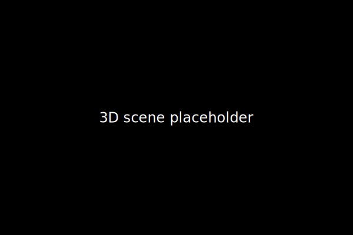

# Hi 👋, I'm bennyhartnett


## 🌐 Live 3D Scene

<p align="center">
  
</p>

## ⚙️ Behind the scenes

<details>
<summary>GitHub Actions Workflow (.github/workflows/update-readme.yml)</summary>

```yaml
name: Update Profile Readme
on:
  schedule:
    - cron: '0 * * * *'
jobs:
  generate-assets:
    runs-on: ubuntu-latest
    steps:
      - uses: actions/checkout@v3
      - name: Setup Node.js
        uses: actions/setup-node@v3
        with:
          node-version: '16'
      - name: Install dependencies
        run: npm install three @svg-canvas
      - name: Generate 3D Scene SVG
        run: node scripts/generate-3d-svg.js
      - name: Commit changes
        run: |
          git config user.name "github-actions[bot]"
          git config user.email "github-actions[bot]@users.noreply.github.com"
          git add assets/3d-scene.svg
          git commit -m "chore: update 3D scene" || echo "No changes"
          git push
```
</details>

<details>
<summary>3D SVG Generator Script (scripts/generate-3d-svg.js)</summary>

```javascript
import fs from 'fs';
import { Scene, PerspectiveCamera, Mesh, BoxGeometry, MeshBasicMaterial } from 'three';
import { SVGRenderer } from 'three/examples/jsm/renderers/SVGRenderer.js';

const width = 600;
const height = 400;
const renderer = new SVGRenderer();
renderer.setSize(width, height);

const scene = new Scene();
const camera = new PerspectiveCamera(75, width / height, 0.1, 1000);
camera.position.z = 3;

const geometry = new BoxGeometry();
const material = new MeshBasicMaterial({ color: 0x00ff00, wireframe: true });
const cube = new Mesh(geometry, material);
scene.add(cube);

// Rotate the cube for a dynamic angle
cube.rotation.x = Math.PI / 4;
cube.rotation.y = Math.PI / 4;

renderer.render(scene, camera);
const svgData = renderer.domElement.outerHTML;
fs.writeFileSync('assets/3d-scene.svg', svgData);
```
</details>

